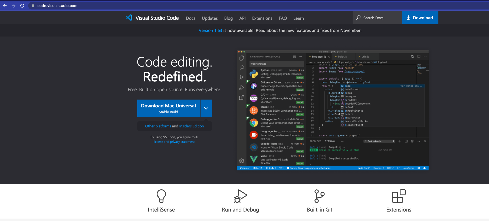

# *A  Tutorial About How to Log into a Course-specific Accout on ieng6*


## 1. Download the Visual Studio Code

Here is the link to download the VScode:[VScode Downloading](https://code.visualstudio.com/)

<br><br>
After downloading the VScode, you could see the window, then you are done with the first step!


<br><br><br><br>

## 2. Connect to Accounts
You could look up your all your UCSD account here: [Account Lookup](https://sdacs.ucsd.edu/~icc/index.php)

Then you should change your CSE 15L account password and wait for up to 40 mins.

On the top of the window you could open the terminal:
<br>


Then you could input the command like this:
```
 $ ssh cs15lwi22ale@ieng6.ucsd.edu 
 ```
<br>
**Noticing "ale" will be replaced by the letters in your course-specific account.**

<br>


*Two way to log out of the remote server:*
1. Run the comman `exit` on the terminal
2. Ctrl-D

<br><br>

## 3. Try Some Commands
Here are some useful commands to try:
* cd
* cd ~
* ls
* ls -a
* ls -lat
* ls  < directory > 


## 4. Moving Files with scp
Now using the below code to create a java file. You can easily copy and paste it.
```
class lab1 {
  public static void main(String[] args) {
    System.out.println(System.getProperty("os.name"));
    System.out.println(System.getProperty("user.name"));
    System.out.println(System.getProperty("user.home"));
    System.out.println(System.getProperty("user.dir"));
  }
}
```
If you have installed java on you computer you use `javac` and `java` command to run the code and you could see some information of your computer.

If you do not install java but are willing to give a try. Here is a button to the instructions of installing java. 

<button class="ui inverted basic button">[Install Java](https://www.oracle.com/java/technologies/javase/jdk14-archive-downloads.html)</button>

Then, in the terminal from the directory where you made this file, run this command:
```
scp lab1.java cs15lwi22ale@ieng6.ucsd.edu:~/
```

**Noticing "ale" will be replaced by the letters in your course-specific account.**


Next:Log into ieng6 with ssh again, and use ls command. You should see the file there in your home directory! Now you can run it on the ieng6 computer using `javac` and `java`. Since java is installed on the server, everyone should be able to run it no matter the client.

<br>

**Here is a sample of the whole process:**


<br>

## 5. Setting an SSH Key
It is annoying and time consuming to type password to log in the account. ssh keys is a great way solving this problem. It is becase ssh-keygen creates two files one is called the public key and the other is private key. Private key is stored on the client while the public key is on the server. Therefore, ssh command can easily use these two keys instead of the password.

Run the command on the client:
```
$ ssh-keygen
```


**Next, copy the public key to the .ssh directory on the server.**
```
$ ssh cs15lwi22ale@ieng6.ucsd.edu
<Enter Password>
# now on server
$ mkdir .ssh
$ exit
# back on client
```


Then you could use ssh and scp from the client to the server without typing password.

<br><br>

## 6.Optimizing Remote Running
There are some other ways to excute the command more efficiently.

Following command can log in the server and list the directory on the server at the same time:
```
$ ssh cs15lwi22ale@ieng6.ucsd.edu "ls"
```

Also semicolons can be used for running mutiple command on the same line.
```
$ cp lab1.java other.java; javac other.java; java lab1
```


