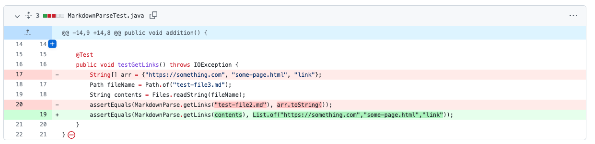
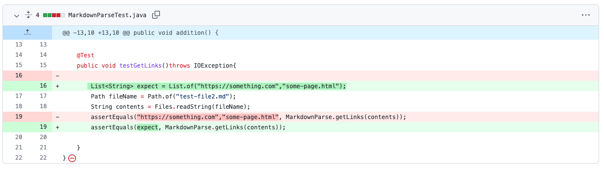

# *Debugging*


## 1. First Code Changes



Here is the link to the test file:   [TestFile3.md](https://github.com/scottieboyzhang/markdown-parse/blob/ded3d4aab327421c1f8613f0e3fad8868a84d881/test-file3.md)

Error Message(Symptom):
```
zhangyuqin@MacBook-Pro markdown-parsee % javac -cp .:lib/junit-4.13.2.jar:lib/hamcrest-core-1.3.jar MarkdownParseTest.java                     
zhangyuqin@MacBook-Pro markdown-parsee % java -cp .:lib/junit-4.13.2.jar:lib/hamcrest-core-1.3.jar org.junit.runner.JUnitCore MarkdownParseTest
JUnit version 4.13.2
.E.
Time: 0.017
There was 1 failure:
1) testGetLinks(MarkdownParseTest)
java.lang.StringIndexOutOfBoundsException: begin 0, end -1, length 13
        at java.base/java.lang.String.checkBoundsBeginEnd(String.java:4601)
        at java.base/java.lang.String.substring(String.java:2704)
        at MarkdownParse.getLinks(MarkdownParse.java:18)
        at MarkdownParseTest.testGetLinks(MarkdownParseTest.java:20)

FAILURES!!!
Tests run: 2,  Failures: 1
```
This is a bug that happens at the same time when bug3 happens. The bug is that I used "test-file3" as argument instead of the variable contents storing the content of the markdown file. Thus, in the getLink() method the parameter is "test-file3" instead of the real string. So the symptom is indexOutOfBounds error. Furthermore, arr.toString() will also cause a failure which will be displayed in bug3. The way to debug the program is using the variable contents and creating a list.
<br><br><br>

## 2. Second Code Changes


Here is the link to the test file:   [TestFile.md](https://github.com/scottieboyzhang/markdown-parse/blob/eb78f615fc5c28d5c9e458c7c9e66447aca67326/test-file.md)

Error Message(Symptom):
```
zhangyuqin@MacBook-Pro markdown-parsee % javac MarkdownParse.java       
zhangyuqin@MacBook-Pro markdown-parsee % java MarkdownParse test-file.md
Exception in thread "main" java.lang.OutOfMemoryError: Java heap space
        at java.base/java.util.Arrays.copyOfRange(Arrays.java:3822)
        at java.base/java.lang.StringLatin1.newString(StringLatin1.java:769)
        at java.base/java.lang.String.substring(String.java:2709)
        at MarkdownParse.getLinks(MarkdownParse.java:20)
        at MarkdownParse.main(MarkdownParse.java:31)
```
The bug is that the code caused an infinite loop since the file ends with an invalid link character. The symptom could be easily seen that the terminal reports outOfMemoryError, which is because the compiler keeps adding links to the arraylist. In this case, we add an if statement and a new variable preIndex to jump out of the loop, debugging the program.

<br><br><br>

## 3. Third Code Changes

Here is the link to the test file:   [TestFile2.md](https://github.com/scottieboyzhang/markdown-parse/blob/c837f191b58c388d452455d228733eea008fd17e/test-file2.md)

Error Message(Symptom):

```
zhangyuqin@MacBook-Pro markdown-parsee % javac -cp .:lib/junit-4.13.2.jar:lib/hamcrest-core-1.3.jar MarkdownParseTest.java
zhangyuqin@MacBook-Pro markdown-parsee % java -cp .:lib/junit-4.13.2.jar:lib/hamcrest-core-1.3.jar org.junit.runner.JUnitCore MarkdownParseTest
JUnit version 4.13.2
.E.
Time: 0.019
There was 1 failure:
1) testGetLinks(MarkdownParseTest)
java.lang.AssertionError: https://something.com expected:<some-page.html> but was:<[https://something.com, some-page.html]>
        at org.junit.Assert.fail(Assert.java:89)
        at org.junit.Assert.failNotEquals(Assert.java:835)
        at org.junit.Assert.assertEquals(Assert.java:120)
        at MarkdownParseTest.testGetLinks(MarkdownParseTest.java:19)

FAILURES!!!
Tests run: 2,  Failures: 1
```
This bug is because I expect a list instead of two strings. The symptom is that the test fails. The easiest way to debug this problem is creating a list by using List.of(), since the markdownparse.getLink() will return an arraylist so the type of two things should be compatible.

