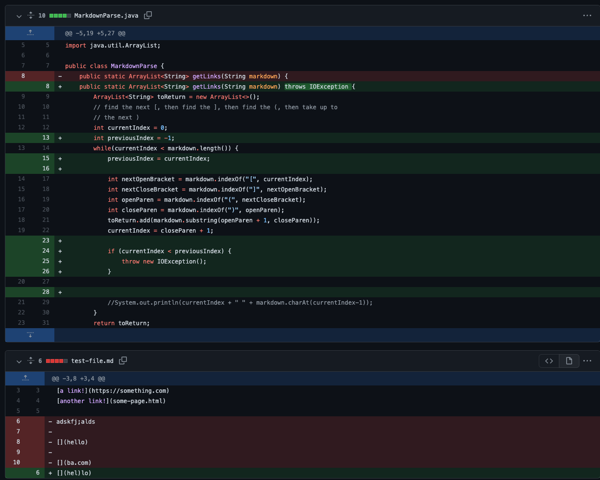

# *Debugging*


## 1. First Code Changes


## 2. Second Code Changes


Here is the link to the test file:   [TestFile](https://github.com/scottieboyzhang/markdown-parse/blob/eb78f615fc5c28d5c9e458c7c9e66447aca67326/test-file.md)

Error Message:
```
zhangyuqin@MacBook-Pro markdown-parsee % javac MarkdownParse.java       
zhangyuqin@MacBook-Pro markdown-parsee % java MarkdownParse test-file.md
Exception in thread "main" java.lang.OutOfMemoryError: Java heap space
        at java.base/java.util.Arrays.copyOfRange(Arrays.java:3822)
        at java.base/java.lang.StringLatin1.newString(StringLatin1.java:769)
        at java.base/java.lang.String.substring(String.java:2709)
        at MarkdownParse.getLinks(MarkdownParse.java:20)
        at MarkdownParse.main(MarkdownParse.java:31)
```
The issue is that the code caused an infinite loop since the file ends with an invalid link character. The symptom could be easily seen that the terminal reports outOfMemoryError, which is because the compiler keeps adding links to the arraylist. In this case, we add an if statement and a new variable preIndex to jump out of the loop, debugging the program.


## 3. Third Code Changes

 List<String> expect = List.of("https://something.com","some-page.html");