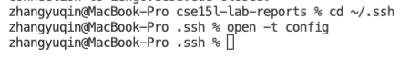

# *Streamline SSH Configuration*

## 1.Create and Modify the .ssh/config file

Create the config file and open it


Modify the file with the following command
```
Host ieng6
    HostName ieng6.ucsd.edu
    User cs15lwi22ale
```


<br>

## 2. Log in to the ieng6 account with ssh


<br>

## 3. Copy a file to ieng6 account
* Using ls to check the current file in ieng6 account
* Using scp the copy a java file into ieng6 account
* Using ls again to check the file is successfully copied
