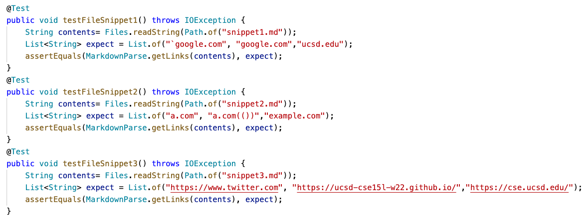

# *Three Snippets*

[LinkToMyRepository](https://github.com/scottieboyzhang/markdown-parse)

[RepositoryReviewed](https://github.com/w2llS/markdown-parse)

This is My MarkdownParseTest.java File


## 1. Snippet 1
The result for my implementation:
```
1) testFileSnippet1(MarkdownParseTest)
java.lang.AssertionError: expected:<[`google.com, google.com, ucsd.edu]> but was:<[url.com, `google.com, google.com, ucsd.edu]>
        at org.junit.Assert.fail(Assert.java:89)
        at org.junit.Assert.failNotEquals(Assert.java:835)
        at org.junit.Assert.assertEquals(Assert.java:120)
        at org.junit.Assert.assertEquals(Assert.java:146)
        at MarkdownParseTest.testFileSnippet1(MarkdownParseTest.java:62)
```

**Possible improvements:** 
The reason why the url.com not showing up is because the backtick. I can add a if statement to check the number of backticks, and if it is even then print the link.


The result for my reviewed implementation:
```
1) getLinksnew1(MarkdownParseTest)
    org.junit.ComparisonFailure: Check first element in array expected:<[`google].com, google.com, ucsd.edu]> but was:<[url].com>
    at org.junit.Assert.assertEquals(Assert.java:117)
    at MarkdownParseTest.getLinksnew1(MarkdownParseTest.java:55)
```


## 2. Snippet 2
The result for my implementation:
```
2) testFileSnippet2(MarkdownParseTest)
java.lang.AssertionError: expected:<[a.com, a.com(()), example.com]> but was:<[a.com, a.com((, example.com]>
        at org.junit.Assert.fail(Assert.java:89)
        at org.junit.Assert.failNotEquals(Assert.java:835)
        at org.junit.Assert.assertEquals(Assert.java:120)
        at org.junit.Assert.assertEquals(Assert.java:146)
        at MarkdownParseTest.testFileSnippet2(MarkdownParseTest.java:68)
```
**Possible improvements:** 
The mutiple parentheses cause this error. The way to fix this bug could be adding a method where recording the leftmost open parenthese and rightmost closing parentheses instead of recording the closing parentheses right after the opening.

The result for my reviewed implementation:
```
2) getLinksnew2(MarkdownParseTest)
    org.junit.ComparisonFailure: Check first element in array expected:<[a.com, a.com(()), example.com]> but was:<[a.com)](b].com>
    at org.junit.Assert.assertEquals(Assert.java:117)
    at MarkdownParseTest.getLinksnew2(MarkdownParseTest.java:66)
```


## 3. Snippet 3
The result for my implementation:
```
3) testFileSnippet3(MarkdownParseTest)
java.lang.AssertionError: expected:<[https://www.twitter.com, https://ucsd-cse15l-w22.github.io/, https://cse.ucsd.edu/]> but was:<[
    https://www.twitter.com
, 
    https://ucsd-cse15l-w22.github.io/
, github.com

And there's still some more text after that.

[this link doesn't have a closing parenthesis for a while](https://cse.ucsd.edu/


]>
        at org.junit.Assert.fail(Assert.java:89)
        at org.junit.Assert.failNotEquals(Assert.java:835)
        at org.junit.Assert.assertEquals(Assert.java:120)
        at org.junit.Assert.assertEquals(Assert.java:146)
        at MarkdownParseTest.testFileSnippet3(MarkdownParseTest.java:74)
```

The result for my reviewed implementation is infinite loop.


**Possible improvements:**
This is the space problem. I think I could easily add .trim() to remove the empty space in the front and rear of the string.

The result for my reviewed implementation:
```
3) getLinksnew3(MarkdownParseTest)
    java.lang.IndexOutOfBoundsException: Index 0 out of bounds for length 0
    at java.base/jdk.internal.util.Preconditions.outOfBounds(Preconditions.java:64)
    at java.base/jdk.internal.util.Preconditions.outOfBoundsCheckIndex(Preconditions.java:70)
    at java.base/jdk.internal.util.Preconditions.checkIndex(Preconditions.java:248)
    at java.base/java.util.Objects.checkIndex(Objects.java:373)
    at java.base/java.util.ArrayList.get(ArrayList.java:426)
    at MarkdownParseTest.getLinksnew3(MarkdownParseTest.java:77)
```