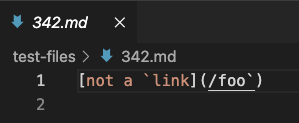
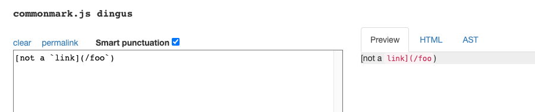

# *Two Markdown Files*

## Using Diff to find results

Using diff command is easy to find list of files with different results. In this case, two txt files are results.txt and markdownparse results.txt.

Command to input:
```
bash script.sh > results.txt.

diff student-mdparse/results.txt markdown-parse/results.txt
```

The newly created file is results.txt which saves output of bash scipt, containing some links. And then we use diff to see the difference.


## TestFile 342.md

 342.md Markdown file content:

 

Other's result: []

My results:[/foo`] 


According to &smart=1)



I think the program should return an empty list since the existence of forward slash and backticks can influence the link. I think my implementation is not correct because in my markdownparse file I dont check the forward slash and backtick symbol. To debug, we can look for forward slash or backticks after looking for brackets.

<br><br><br>

## TestFile 192.md

192.md Markdown file content:
```
[cs15lwi22ale@ieng6-201]:~:243$ cat markdown-parsee/markdown-parse/test-files/192.md
[foo]: /url "title"

[foo]
```

My result v.s Other's result:

```
212c212
< []
---
> [url]
```

I think the correct implmentation is that empty link will be returned, since the existence can influence brackets and parentheses, so my implementation is correct. Here the bug is that the other implementation recognizes "url" as a link and ignore the existence of the forward slash sign. In order to fix this issue we could simply add an if statement to look for forward slash and the parentheses.

